# Agent2Agent (A2A) Protocol:

The A2A protocol is an open standard that enables seamless communication and collaboration between AI agents. It provides a common language for agents built using diverse frameworks and by different vendors, fostering interoperability and breaking down silos. 

Agents are autonomous problem-solvers that act independently within their environment. 

A2A allows agents from different developers, built on different frameworks, and owned by different organizations to unite and work together.

- An open standard designed to enable seamless communication and collaboration between AI agents.
- Originally developed by Google and now donated to the Linux Foundation, A2A provides the definitive common language for agent interoperability in a world where agents are built using diverse frameworks and by different vendors.


## Why use the A2A Protocol:

A2A addresses key challenges in AI agent collaboration. It provides a standardized approach for agents to interact. 

**1.Secure collaboration:**

A2A uses HTTPS for secure communication and maintains opaque operations, so agents can't see the inner workings of other agents during collaboration.

**2.Reduced integration complexity:**

The protocol standardizes agent communication, enabling teams to focus on the unique value their agents provide.

**3.Interoperability:**

Connect agents built on different platforms (LangGraph, CrewAI, Semantic Kernel, custom solutions) to create powerful, composite AI systems.

**4.Complex Workflows:**

Enable agents to delegate sub-tasks, exchange information, and coordinate actions to solve complex problems that a single agent cannot.

**5.Secure & Opaque:**

Agents interact without needing to share internal memory, tools, or proprietary logic, ensuring security and preserving intellectual property.

**6.Support for LRO:**

The protocol supports long-running operations (LRO) and streaming with Server-Sent Events (SSE) and asynchronous execution.

# How does A2A work with MCP:

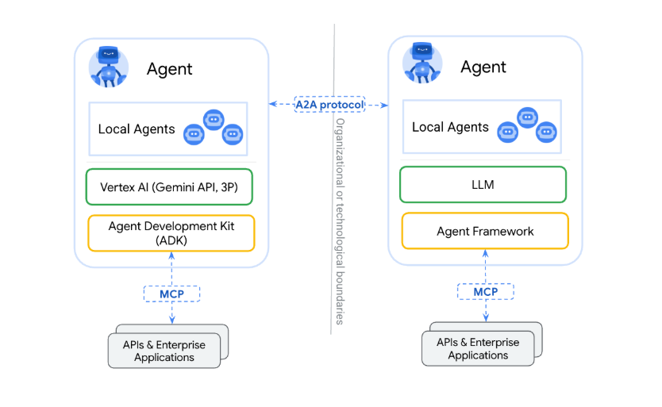
The Agent2Agent (A2A) protocol is designed to standardize communication between AI agents, particularly those deployed in external systems. A2A and Model Context Protocol (MCP) are complementary standards for building robust agentic applications:


**MCP's Focus:** 

Reducing the complexity involved in connecting agents with tools and data. Tools are typically stateless and perform specific, predefined functions (e.g., a calculator, a database query).

**A2A's Focus:** 

Enabling agents to collaborate within their native modalities, allowing them to communicate as agents (or as users) rather than being constrained to tool-like interactions. This enables complex, multi-turn interactions where agents reason, plan, and delegate tasks to other agents. For example, this facilitates multi-turn interactions, such as those involving negotiation or clarification when placing an order.

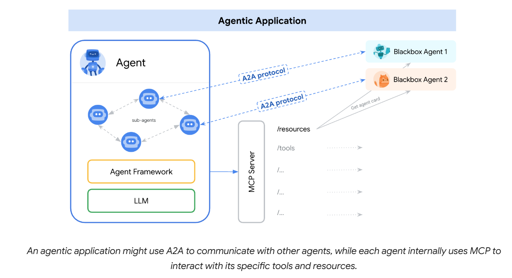

## Understanding the Agent Stack: A2A, MCP, Agent Frameworks and Models:
A2A is situated within a broader agent stack, which includes:

**A2A:** Standardizes communication among agents deployed in different organizations and developed using diverse frameworks.

**MCP:** Connects models to data and external resources.

**Frameworks (like ADK):** Provide toolkits for constructing agents.

**Models:** Fundamental to an agent's reasoning, these can be any Large Language Model (LLM).


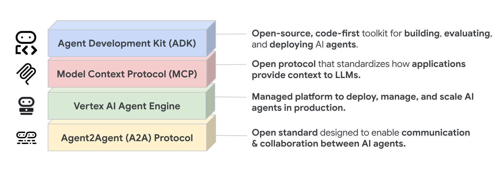


## A2A Request Lifecycle:

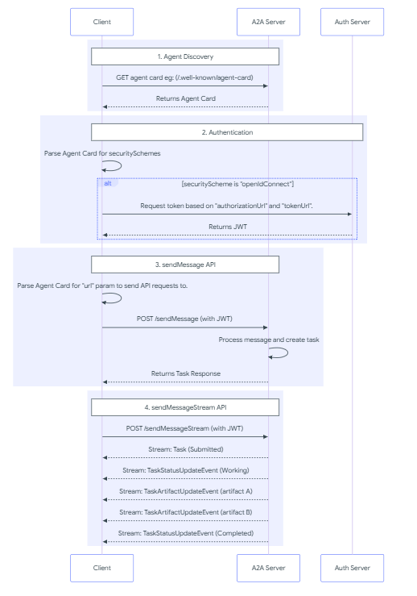


## Core Actors in A2A Interactions:

**User:** 

The end user, which can be a human operator or an automated service. The user initiates a request or defines a goal that requires assistance from one or more AI agents.

**A2A Client (Client Agent):**

An application, service, or another AI agent that acts on behalf of the user. The client initiates communication using the A2A protocol.

**A2A Server (Remote Agent):**

An AI agent or an agentic system that exposes an HTTP endpoint implementing the A2A protocol. It receives requests from clients, processes tasks, and returns results or status updates. From the client's perspective, the remote agent operates as an opaque (black-box) system, meaning its internal workings, memory, or tools are not exposed.

## Fundamental Communication Elements:

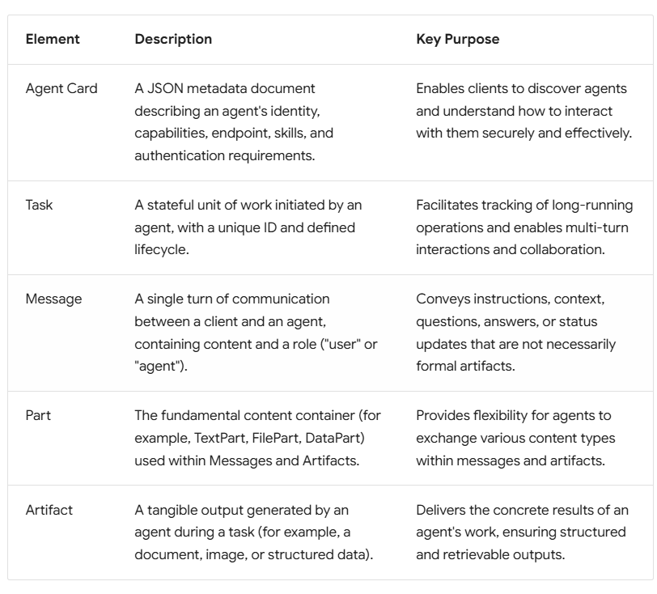


## Interaction Mechanisms:

These mechanisms ensure that agents can exchange information efficiently and reliably, regardless of the task's complexity or duration:

**Request/Response (Polling):** 

Clients send a request and the server responds. For long-running tasks, the client periodically polls the server for updates.

**Streaming with Server-Sent Events (SSE):** 

Clients initiate a stream to receive real-time, incremental results or status updates from the server over an open HTTP connection.

**Push Notifications:** 

For very long-running tasks or disconnected scenarios, the server can actively send asynchronous notifications to a client-provided webhook when significant task updates occur.

## Agent Discovery in A2A:

To collaborate using the Agent2Agent (A2A) protocol, AI agents need to first find each other and understand their capabilities. A2A standardizes agent self-descriptions through the Agent Card. 

### Discovery Strategies:

**1. Well-Known URI:**

This approach is recommended for public agents or agents intended for broad discovery within a specific domain.

Mechanism:

- A2A Servers make their Agent Card discoverable by hosting it at a standardized, well-known URI on their domain. The standard path is https://{agent-server-domain}/.well-known/agent-card.json

Process:

- A client agent knows or programmatically discovers the domain of a potential A2A Server.

- The client performs an HTTP GET request.

- If the Agent Card exists and is accessible, the server returns it as a JSON response.

**2. Curated Registries (Catalog-Based Discovery):**

This approach is employed in enterprise environments or public marketplaces, where Agent Cards are often managed by a central registry. The curated registry acts as a central repository, allowing clients to query and discover agents based on criteria like "skills" or "tags".

Mechanism: 

- An intermediary service (the registry) maintains a collection of Agent Cards. Clients query this registry to find agents based on various criteria (e.g., skills offered, tags, provider name, capabilities).

Process:

- A2A Servers publish their Agent Cards to the registry.

- Client agents query the registry's API, and search by criteria such as "specific skills".

- The registry returns matching Agent Cards or references.

**3. Direct Configuration / Private Discovery:**

This approach is used for tightly coupled systems, private agents, or development purposes, where clients are directly configured with Agent Card information or URLs.

Mechanism: 
- Client applications utilize hardcoded details, configuration files, environment variables, or proprietary APIs for discovery.

Process: 
- The process is specific to the application's deployment and configuration strategy.

## Securing Agent Cards:

**Authenticated Agent Cards:** We recommend the use of authenticated extended agent cards for sensitive information or for serving a more detailed version of the card.

**Secure Endpoints:** Implement access controls on the HTTP endpoint serving the Agent Card (e.g., /.well-known/agent-card.json or registry API). The methods include:

- Mutual TLS (mTLS)
- Network restrictions (e.g., IP ranges)
- HTTP Authentication (e.g., OAuth 2.0)

**Registry Selective Disclosure:** Registries return different Agent Cards based on the client's identity and permissions.

# Sequence Diagram:

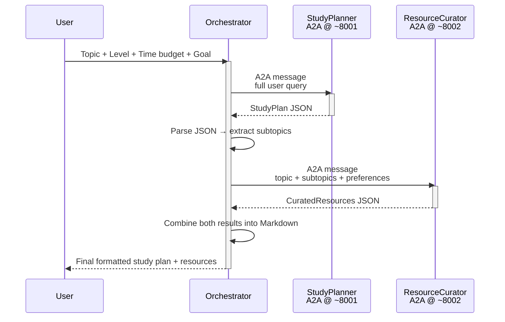
## Agent Skills & Agent Card:


**Agent Skills:**

An Agent Skill describes a specific capability or function the agent can perform. It's a building block that tells clients what kinds of tasks the agent is good for.

Key attributes of an AgentSkill (defined in a2a.types):

- id: A unique identifier for the skill.
- name: A human-readable name.
- description: A more detailed explanation of what the skill does.
- tags: Keywords for categorization and discovery.
- examples: Sample prompts or use cases.
- inputModes / outputModes: Supported Media Types for input and output (e.g., "text/plain", "application/json").


**Agent Card:**

An Agent Card is a JSON object that describes an agent's capabilities and skills. It is used to discover and understand the agent's capabilities.

Key attributes of an AgentCard (defined in a2a.types):

- id: A unique identifier for the agent.
- name: A human-readable name.
- description: A more detailed explanation of what the agent does.
- skills: A list of AgentSkills the agent can perform.
- tags: Keywords for categorization and discovery.
- examples: Sample prompts or use cases.
- inputModes / outputModes: Supported Media Types for input and output (e.g., "text/plain", "application/json").


# Evaluation of the A2A Protocol Agents:

Here we are using the ADK Evaluation framework to evaluate the A2A Protocol Agents. The evaluation is done using the eval_config.json file. The eval_config.json file is a JSON file that contains the evaluation configuration. It is used to define the criteria for the evaluation and the judge model to be used. The judge model is used to evaluate the responses of the agents. 

We have used the following criteria for evaluation:

- tool_trajectory_avg_score: The average score of the tool trajectory.
- response_match_score: The score of the response match.
- final_response_match_v2: The score of the final response match.
- rubric_based_tool_use_quality_v1: The score of the rubric based tool use quality.

The judge model used is gemini-2.5-flash.

The eval_config.json file is as follows:

```json
{
    "criteria": {
        "tool_trajectory_avg_score": {
            "threshold": 1.0,
            "match_type": "ANY_ORDER"
        },
        "response_match_score": {
            "threshold": 0.6
        },
        "final_response_match_v2": {
            "threshold": 0.7,
            "judge_model_options": {
                "judge_model": "gemini-2.5-flash",
                "num_samples": 3
            }
        },
        "rubric_based_tool_use_quality_v1": {
            "threshold": 1.0,
            "judge_model_options": {
                "judge_model": "gemini-2.5-flash",
                "num_samples": 3
            },
            "rubrics": [
                {
                    "rubric_id": "parse_document_tool_called",
                    "rubric_content": {
                        "text_property": "The agent correctly calls parse_document_tool with file_path argument when given resume or JD paths."
                    }
                }
            ]
        }
    }
}
```


The eval_config.json file is used to define the criteria for the evaluation and the judge model to be used. The judge model is used to evaluate the responses of the agents. The judge model is specified in the eval_config.json file.

Command used for evaluation is as follows:
```bash
adk eval `
>>   .\agents\orchestrator `
>>   .\tests\golden\study_orchestrator.evalset.json `
>>   --config_file_path .\tests\eval_config.json `
>>   --print_detailed_results
```


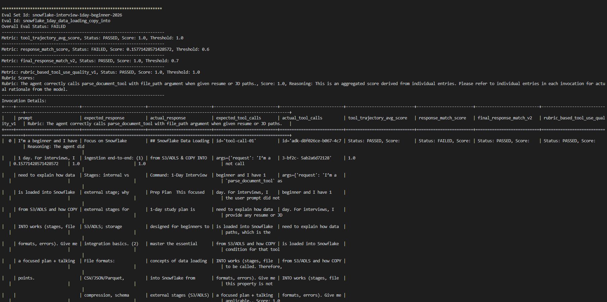


# ADK WEB UI:


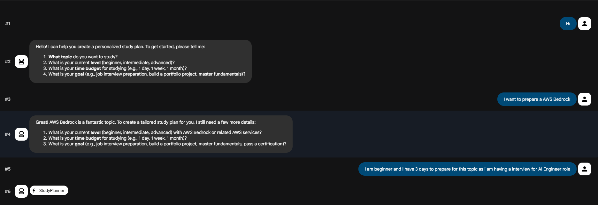


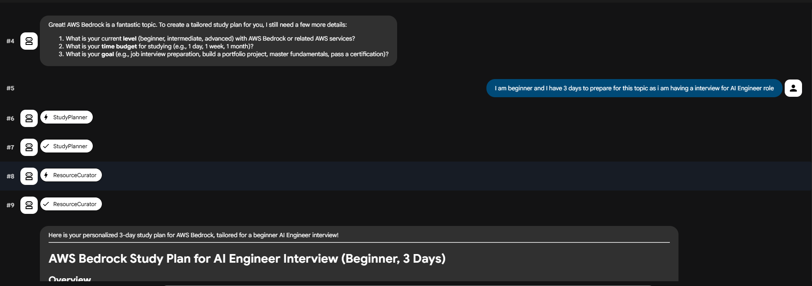

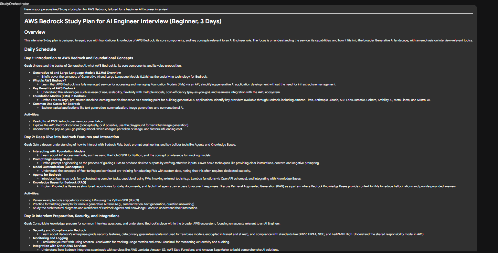

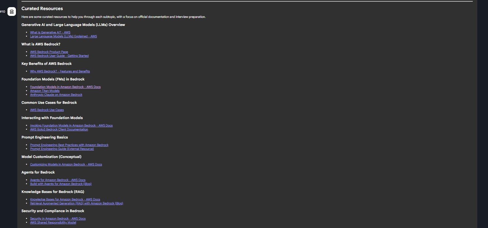

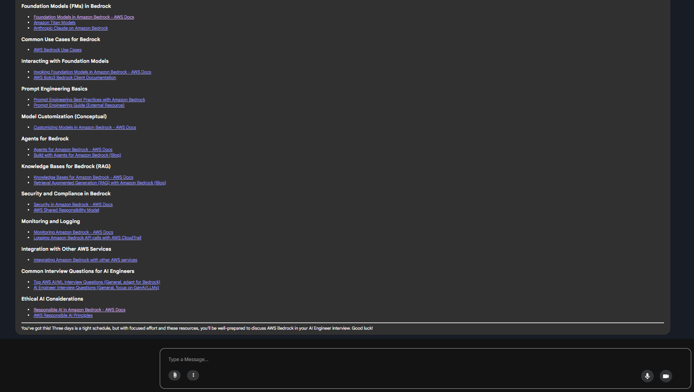


# Lets Observe How tool calling is working:

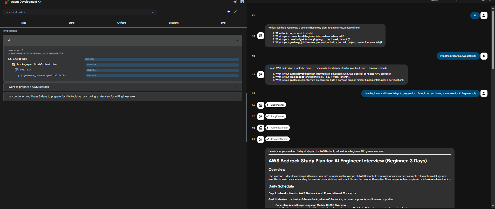


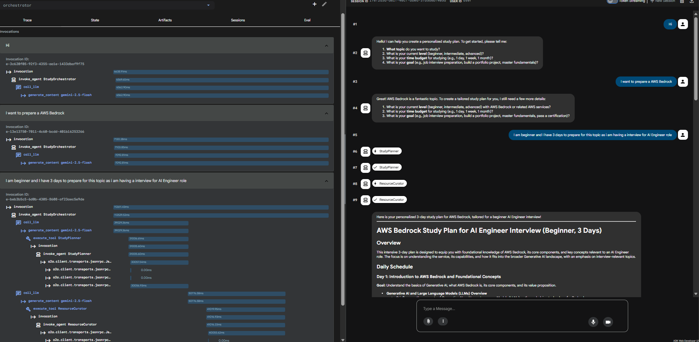


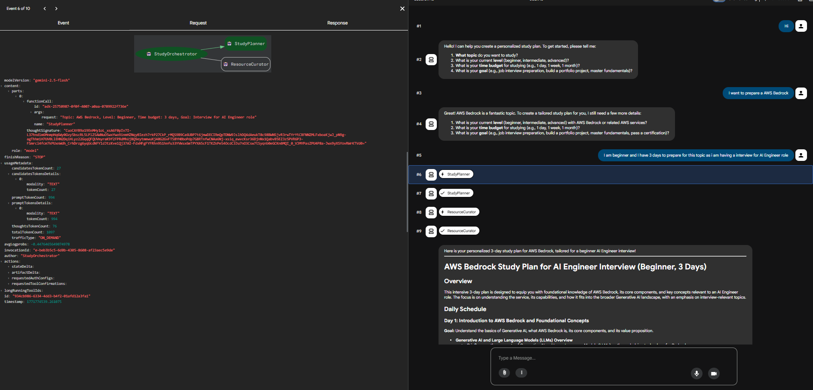

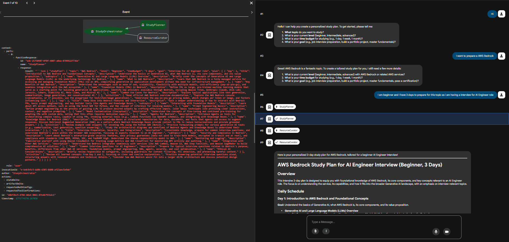

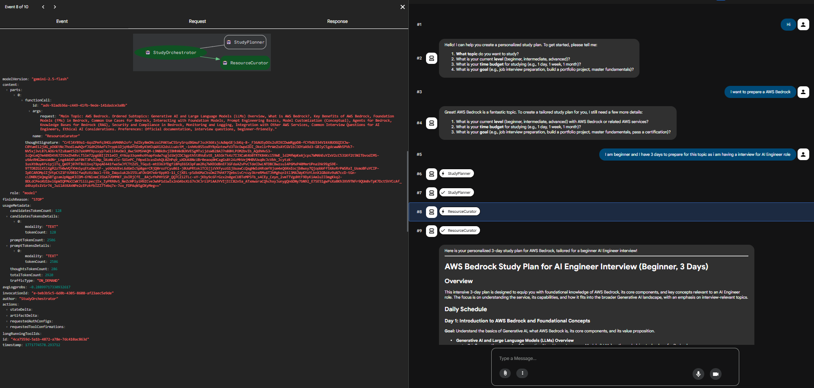

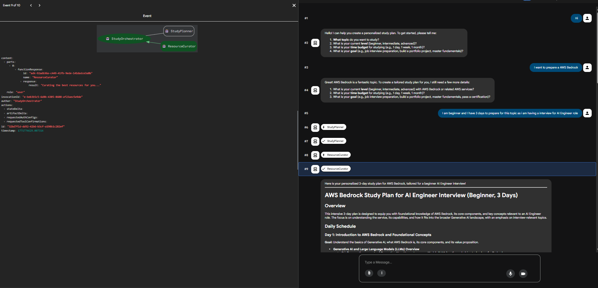

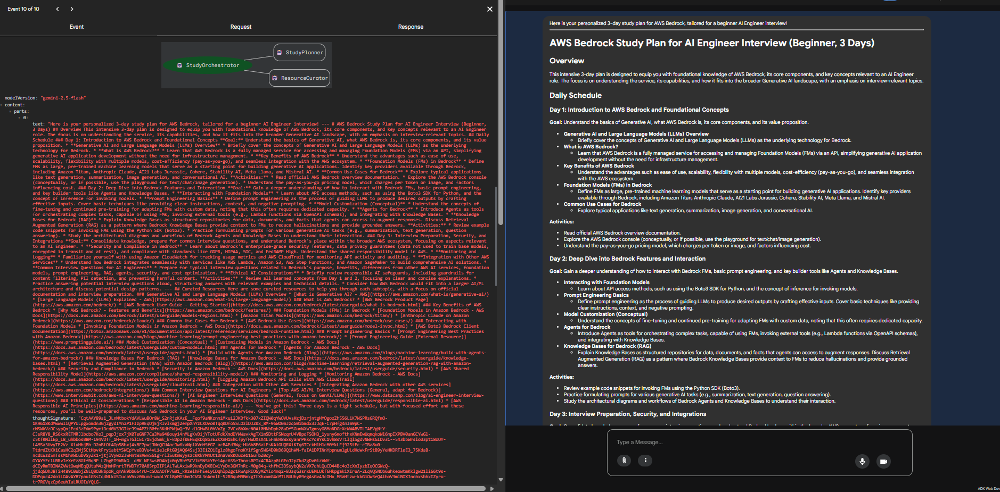


# Architecture:

```mermaid
graph TD
    A[User enters query<br>Topic + Level + Time + Goal] --> B[Orchestrator Agent<br>root / StudyOrchestrator]

    subgraph "Orchestrator Gemini + ADK Runner"
        B -->|1. LLM calls tool| C[generate_study_plan tool]
        C -->|A2A HTTP request| D[StudyPlanner Agent<br>A2A Server ~8001]
        
        D -->|returns StudyPlan JSON| C
        C -->|JSON received| B

        B -->|2. extract subtopics| E[curate_resources tool]
        E -->|A2A HTTP request| F[ResourceCurator Agent<br>A2A Server ~8002]
        
        F -->|returns CuratedResources JSON| E
        E -->|JSON received| B
    end

    B -->|3. combine plan + resources| G[Formatted Markdown Output<br>• Topic & Goal<br>• Subtopics & Schedule<br>• Resources per subtopic<br>• Advice]

    G --> H[Final Response to User]

    %% Styling (optional)
    style A fill:#f0f4f8,stroke:#d35400, color:#000
    style H fill:#d1e7ff,stroke:#d35400,stroke-width:2px, color:#000
    style B fill:#fff9e6,stroke:#d35400, color:#000

    classDef agent fill:#e6f3ff,stroke:#d35400, color:#000
    class B,D,F agent
    ```


